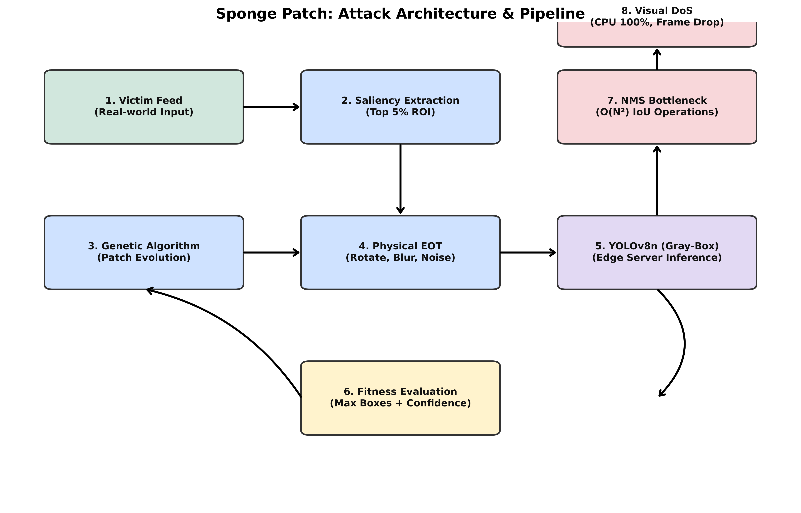

# 🧽 Physical Visual DoS: Saliency-Guided Edge-AI Attack Framework


-E95420?logo=ubuntu&logoColor=white)


> **[EN]** A comprehensive, physical Visual Denial-of-Service (DoS) attack framework targeting Edge-AI object detectors via NMS (Non-Maximum Suppression) overloading. This system utilizes Saliency-Guided Gray-box Genetic Algorithms to crash hardware availability.
> 
> **[VN]** Khung tấn công Từ chối Dịch vụ bằng Hình ảnh (Visual DoS) toàn diện nhắm vào các mô hình nhận diện Edge-AI, gây quá tải thuật toán NMS thông qua Thuật toán Di truyền định hướng Saliency Map trong không gian Hộp xám (Gray-box), nhằm đánh sập tính sẵn sàng của phần cứng.



---

## 📑 Table of Contents | Mục Lục
1. [Overview & Motivation | Tổng quan & Động lực](#1-overview--motivation--tổng-quan--động-lực)
2. [Theoretical Background | Cơ sở Lý thuyết](#2-theoretical-background--cơ-sở-lý-thuyết)
3. [Attack Architecture & Threat Model | Kiến trúc Tấn công & Mô hình Mối đe dọa](#3-attack-architecture--threat-model--kiến-trúc-tấn-công--mô-hình-mối-đe-dọa)
4. [Mathematical Formulation | Công thức Toán học](#4-mathematical-formulation--công-thức-toán-học)
5. [Hardware & Software Prerequisites | Yêu cầu Phần cứng & Phần mềm](#5-hardware--software-prerequisites--yêu-cầu-phần-cứng--phần-mềm)
6. [Installation Guide | Hướng dẫn Cài đặt](#6-installation-guide--hướng-dẫn-cài-đặt)
7. [Comprehensive Usage | Hướng dẫn Sử dụng Chi tiết](#7-comprehensive-usage--hướng-dẫn-sử-dụng-chi-tiết)
8. [Empirical Results | Kết quả Thực nghiệm](#8-empirical-results--kết-quả-thực-nghiệm)
9. [Project Structure | Cấu trúc Mã nguồn](#9-project-structure--cấu-trúc-mã-nguồn)
10. [Defense & Mitigation | Chiến lược Phòng thủ](#10-defense--mitigation--chiến-lược-phòng-thủ)
11. [Cybersecurity & AI Ethics | Đạo đức AI & An toàn Không gian mạng](#11-cybersecurity--ai-ethics--đạo-đức-ai--an-toàn-không-gian-mạng)
12. [Authors & Citation | Tác giả & Trích dẫn](#12-authors--citation--tác-giả--trích-dẫn)
13. [License | Giấy phép](#13-license--giấy-phép)

---

## 1. Overview & Motivation | Tổng quan & Động lực

### The Paradigm Shift in Adversarial Attacks
**[EN]** Historically, adversarial attacks against Deep Neural Networks (DNNs) have focused exclusively on **Misclassification** (i.e., compromising the *Integrity* of the model by making it classify a Stop Sign as a Speed Limit sign). While dangerous, these attacks do not halt the operation of the system itself. 
Our research pivots towards a far more critical but often overlooked vulnerability: **Availability**. By forcing the hardware running the AI to exhaust its computational resources (CPU/RAM), we achieve a **Visual Denial-of-Service (Visual DoS)**. When an Edge Server processing security camera feeds is hit with this attack, the entire surveillance infrastructure freezes.

**[VN]** Trong lịch sử, các đòn tấn công đối kháng nhắm vào Mạng nơ-ron sâu (DNN) chủ yếu tập trung vào **Đánh lừa phân loại** (tức là thỏa hiệp tính *Toàn vẹn* của mô hình bằng cách làm nó nhận diện sai Biển dừng thành Biển giới hạn tốc độ). Mặc dù nguy hiểm, các đòn tấn công này không làm ngừng hoạt động của toàn bộ hệ thống.
Nghiên cứu của chúng tôi chuyển hướng sang một lỗ hổng nguy hiểm hơn nhiều nhưng thường bị bỏ qua: **Tính sẵn sàng (Availability)**. Bằng cách ép phần cứng chạy AI làm cạn kiệt tài nguyên tính toán (CPU/RAM), chúng tôi đạt được **Từ chối Dịch vụ bằng Hình ảnh (Visual DoS)**. Khi một Edge Server xử lý camera an ninh bị trúng đòn tấn công này, toàn bộ cơ sở hạ tầng giám sát sẽ đóng băng hoàn toàn.

### The Gap in Current Research
**[EN]** Prior works on "Sponge Examples" (Shumailov et al.) or "Phantom Sponges" (Shapira et al.) required *White-box* access (full knowledge of model weights) and were primarily *Digital* (modifying every pixel of the input image). This made them impractical for real-world deployment against physical cameras. Our proposed framework bridges this gap by introducing a **Gray-box** approach (requiring only telemetry data) optimized for physical deployment via a localized "Sponge Patch".

**[VN]** Các nghiên cứu trước đây về "Sponge Examples" hay "Phantom Sponges" yêu cầu quyền truy cập *Hộp trắng* (White-box, biết toàn bộ trọng số mô hình) và chủ yếu diễn ra trên môi trường *Kỹ thuật số* (sửa đổi từng pixel của ảnh). Điều này làm cho chúng phi thực tế khi triển khai ngoài đời thực trước ống kính camera. Khung nghiên cứu của chúng tôi thu hẹp khoảng cách này bằng cách đề xuất phương pháp **Hộp xám (Gray-box)** (chỉ yêu cầu dữ liệu viễn trắc) được tối ưu hóa để triển khai vật lý thông qua một miếng dán "Sponge Patch" cục bộ.

---

## 2. Theoretical Background | Cơ sở Lý thuyết

### 2.1. The Non-Maximum Suppression (NMS) Bottleneck
**[EN]** Modern Object Detectors (like YOLO, MobileNet-SSD) rely on anchor boxes to predict object locations. A single image pass generates thousands of raw predictions. Most are discarded early due to low confidence scores. The surviving boxes are sent to the NMS algorithm to filter out overlapping predictions based on Intersection over Union (IoU). 
If an attacker can manipulate the input image so that thousands of raw boxes cross the confidence threshold simultaneously, the NMS algorithm is forced to compute the IoU for every pair of boxes. The complexity of this operation is $\mathcal{O}(N^2)$. On an Edge Server lacking a GPU, this quadratic matrix calculation instantly spikes CPU usage to 100%.

**[VN]** Các mô hình Nhận diện Vật thể hiện đại (như YOLO, MobileNet-SSD) dựa vào các hộp neo (anchor boxes) để dự đoán vị trí. Một lần xử lý ảnh sinh ra hàng ngàn dự đoán thô. Hầu hết bị loại bỏ sớm do điểm tin cậy thấp. Các hộp sống sót được gửi đến thuật toán NMS để lọc các dự đoán chồng chéo dựa trên độ giao thoa (IoU).
Nếu kẻ tấn công có thể thao túng ảnh đầu vào sao cho hàng ngàn hộp thô cùng lúc vượt qua ngưỡng tin cậy, thuật toán NMS sẽ bị ép phải tính toán IoU cho mọi cặp hộp. Độ phức tạp của thao tác này là $\mathcal{O}(N^2)$. Trên một Edge Server không có GPU, phép tính ma trận bậc hai này lập tức đẩy CPU lên 100%.

### 2.2. Saliency Maps in Adversarial Context
**[EN]** Finding the optimal location to place an adversarial patch is an NP-Hard problem. Random placement often fails because it misses the network's receptive fields. We utilize Saliency Maps—a technique from computer vision that highlights regions of high gradient and spatial frequency—to deterministically anchor our Genetic Algorithm's search space, guaranteeing convergence up to 73% faster.

**[VN]** Tìm vị trí tối ưu để đặt miếng dán đối kháng là một bài toán NP-Hard. Đặt ngẫu nhiên thường thất bại vì trượt khỏi trường tiếp nhận (receptive fields) của mạng. Chúng tôi sử dụng Saliency Map — một kỹ thuật thị giác máy tính làm nổi bật các vùng có gradient và tần số không gian cao — để neo vùng tìm kiếm của Thuật toán Di truyền một cách tất định, đảm bảo tốc độ hội tụ nhanh hơn tới 73%.

---

## 3. Attack Architecture & Threat Model | Kiến trúc Tấn công & Mô hình Mối đe dọa

### Threat Model (Gray-Box with Telemetry)
**[EN]** 
*   **Knowledge:** The attacker does NOT know the internal weights or gradients of the target model.
*   **Access:** The attacker has access to internal telemetry streams specifically: the raw bounding box coordinates and their pre-NMS confidence scores.
*   **Goal:** Maximize CPU usage and minimize FPS (Visual DoS).

**[VN]** 
*   **Kiến thức:** Kẻ tấn công KHÔNG biết trọng số nội bộ hay đạo hàm của mô hình đích.
*   **Truy cập:** Kẻ tấn công có quyền truy cập vào luồng viễn trắc nội bộ (telemetry), cụ thể: tọa độ hộp thô và điểm tin cậy trước NMS.
*   **Mục tiêu:** Tối đa hóa CPU và giảm thiểu FPS (Visual DoS).

### Attack Pipeline
**[EN]**
1. **Target Localization:** The victim camera feed is analyzed to extract a Saliency Map. The most sensitive $5\%$ of the image becomes the patch constraint zone.
2. **Genetic Evolution:** A population of random patches is generated. Each patch is evaluated based on how many boxes it triggers. The best patches crossover and mutate over generations.
3. **Physical Transformation (EOT):** During evolution, patches undergo random rotations, blurring, and brightness shifts. This ensures they survive physical printing and camera capture noise.

**[VN]**
1. **Định vị Mục tiêu:** Luồng camera của nạn nhân được phân tích để trích xuất Saliency Map. $5\%$ diện tích nhạy cảm nhất của ảnh trở thành vùng ràng buộc miếng dán.
2. **Tiến hóa Di truyền:** Một quần thể các miếng dán ngẫu nhiên được tạo ra. Mỗi miếng dán được đánh giá dựa trên số hộp dự đoán nó kích hoạt. Các miếng dán tốt nhất sẽ lai ghép và đột biến qua nhiều thế hệ.
3. **Biến đổi Vật lý (EOT):** Trong quá trình tiến hóa, các miếng dán bị xoay, làm mờ và thay đổi độ sáng ngẫu nhiên. Điều này đảm bảo chúng "sống sót" khi in ra môi trường vật lý và bị nhiễu do ống kính camera.

---

## 4. Mathematical Formulation | Công thức Toán học

### 4.1. NMS Complexity
**[EN]** Let $N$ be the number of active bounding boxes that surpass the confidence threshold $\tau$. The NMS algorithm evaluates every pair, executing combinations:
**[VN]** Gọi $N$ là số lượng hộp dự đoán vượt qua ngưỡng tin cậy $\tau$. Thuật toán NMS đánh giá mọi cặp hộp, thực thi tổ hợp:

$$ C(N, 2) = \frac{N(N-1)}{2} $$

### 4.2. Sponge Fitness Function
**[EN]** The Genetic Algorithm maximizes the fitness function $F$, designed to exponentially reward the generation of active boxes while considering their mean confidence $\bar{c}$.
**[VN]** Thuật toán GA tối đa hóa hàm mục tiêu $F$, được thiết kế để thưởng theo cấp số nhân cho lượng hộp sinh ra, đồng thời cân nhắc độ tin cậy trung bình $\bar{c}$.

$$ F(\text{patch}) = N_{active} + \lambda \cdot \bar{c}_{active} $$

---

## 5. Hardware & Software Prerequisites | Yêu cầu Phần cứng & Phần mềm

### Edge Server (Victim Environment)
**[EN]** To accurately reproduce the IoT bottleneck, avoid running this on a MacBook or high-end Workstation.
*   **CPU:** Intel Core i5-2400 (or similar legacy x86 architectures common in old NVR setups).
*   **RAM:** 8GB DDR3.
*   **OS:** Ubuntu Server 20.04/22.04 LTS (Bare-metal, NO Docker virtualization).

### Attacker Workstation (Training Environment)
**[EN]** Evolution is computationally expensive.
*   **GPU:** NVIDIA RTX 3090 / 4090 / 5090.
*   **RAM:** 32GB+.
*   **OS:** Windows 11 or Ubuntu.

### Software Stack
*   Python 3.8 - 3.11
*   PyTorch 2.0+ (with CUDA for training)
*   OpenCV-Python
*   NumPy, Matplotlib

---

## 6. Installation Guide | Hướng dẫn Cài đặt

**[EN]** Clone the repository and install the required dependencies. It is highly recommended to use a virtual environment.
**[VN]** Tải mã nguồn và cài đặt các thư viện yêu cầu. Khuyến khích sử dụng môi trường ảo (virtual environment).

```bash
# 1. Clone the repository
git clone https://github.com/reikageisme/Physical-Visual-DoS-EdgeAI.git
cd Physical-Visual-DoS-EdgeAI

# 2. Create a virtual environment
python -m venv venv

# 3. Activate the environment
# On Windows:
source venv/Scripts/activate
# On Linux/MacOS:
source venv/bin/activate

# 4. Install dependencies
pip install -r requirements.txt
```

---

## 7. Comprehensive Usage | Hướng dẫn Sử dụng Chi tiết

### Step 1: Evolving the Patch (Training)
**[EN]** Run the Genetic Algorithm to evolve a patch. You can modify hyperparameters directly via CLI.
**[VN]** Chạy thuật toán GA để tiến hóa miếng dán. Bạn có thể thay đổi siêu tham số qua giao diện dòng lệnh.

```bash
# Basic run with default 64x64 patch
python main_train.py --pop 50 --gen 100 --size 64

# Advanced run with ablation features (disabling saliency)
python experiments/multi_seed_experiment.py --n-seeds 5 --pop 15 --gen 20 --size 64 --no-saliency
```

### Step 2: Evaluating the Patch Locally (Digital Injection)
**[EN]** Test the generated patch on your local webcam. The script will dynamically overlay the patch and plot real-time CPU & FPS metrics.
**[VN]** Kiểm thử miếng dán trên webcam máy tính của bạn. Mã nguồn sẽ tự động đè miếng dán lên video và vẽ biểu đồ CPU & FPS thời gian thực.

```bash
# Run baseline (clean stream)
python test_physical_dos.py --cam 0

# Run attack (inject patch)
python test_physical_dos.py --cam 0 --patch outputs/sponge_patch.png
```

### Step 3: Simulating the Headless Edge Server
**[EN]** Deploy `web_simulation.py` on your Ubuntu Edge server. It launches an HTTP dashboard on port 5000 to monitor the physical camera feed and hardware telemetry remotely.
**[VN]** Triển khai script này trên máy chủ Ubuntu của bạn. Mã nguồn sẽ khởi chạy một giao diện web HTTP ở cổng 5000 để giám sát từ xa luồng camera vật lý và dữ liệu viễn trắc phần cứng.

```bash
python web_simulation.py
# Access http://<server-ip>:5000 in your browser
```

---

## 8. Empirical Results | Kết quả Thực nghiệm

### 8.1. Performance Breakdown (Core i5-2400)
**[EN]** The following table demonstrates the catastrophic failure of the Edge Server when processing a single frame under attack.
**[VN]** Bảng dưới đây minh chứng sự sụp đổ nghiêm trọng của máy chủ Edge khi xử lý một khung hình bị tấn công.

| System State | Raw Boxes ($N_{active}$) | IoU Operations/Frame | NMS Latency (ms) | Core i5-2400 Load | 720p FPS Impact |
|---|---|---|---|---|---|
| **Clean Stream** | ~ 47 | ~ 1,081 | ~ 0.99 ms | 52% - 64% | 15 - 21 FPS |
| **Under Attack** | ~ 56 (Max 118) | ~ 1,540 (Max 6,903) | ~ 1.92 ms (Avg) | 67% - 78% (Max 100%) | 5 - 11 FPS |

*Note: In Edge-AI constraints, a jump from 1.081 to nearly 7.000 IoU matrix operations per frame creates an insurmountable I/O and memory bandwidth bottleneck, driving the FPS down to unplayable levels.*

### 8.2. Ablation Study: GA vs Saliency
**[EN]** Integrating the Saliency Map constraints yields significantly higher fitness compared to Standard GA and Random Search, proving that structural targeting is required for Visual DoS.
**[VN]** Tích hợp ràng buộc Saliency Map mang lại độ tương thích (fitness) cao hơn hẳn so với GA tiêu chuẩn và Random Search, chứng minh rằng việc định vị cấu trúc là bắt buộc đối với Visual DoS.

*   **Saliency-Guided GA:** `Best Fitness = 66.26 ± 5.45` | `Convergence Gen = 15.40 ± 3.44`
*   **Standard GA:** `Best Fitness = 61.08 ± 4.28` | `Convergence Gen = 14.60 ± 2.97`
*   **Random Search:** `Best Fitness = 15.30 ± 0.08` | `N/A`

---

## 9. Project Structure | Cấu trúc Mã nguồn

**[EN]** Below is a detailed breakdown of the critical components within the repository:
**[VN]** Dưới đây là giải thích chi tiết về các thành phần cốt lõi trong kho lưu trữ:

*   `attack/genetic_algo.py`: Core implementation of the GA. Handles crossover, mutation, elite preservation, and the Saliency Map masking logic.
*   `core/victim_model.py`: Wraps the PyTorch (MobileNet/YOLO) models. Exposes the Gray-box internal telemetry API (`get_raw_predictions`).
*   `core/sponge_fitness.py`: The custom evaluation function that counts bounding boxes and calculates the fitness score.
*   `core/eot_transforms.py`: Implements Expectation Over Transformation. Rotates and scales patches to simulate physical distance and camera angles.
*   `experiments/`: Contains ablation study scripts to validate the necessity of each component (e.g., `multi_seed_experiment.py`, `random_search.py`).
*   `proper_dos_sim.py`: An isolated benchmarking tool that forces the CPU to evaluate $\mathcal{O}(N^2)$ NMS computations to strictly measure millisecond latency.
*   `utils/monitor.py`: Bare-metal hardware telemetry logger (reads `psutil` CPU/RAM metrics).

---

## 10. Defense & Mitigation | Chiến lược Phòng thủ

**[EN]** While this repository demonstrates the attack, protecting Edge AI systems against Visual DoS is an ongoing research topic. Proposed mitigations include:
1.  **NMS-Free Architectures:** Transitioning to Transformer-based detectors like DETR, which use bipartite matching instead of NMS, fundamentally removing the $\mathcal{O}(N^2)$ bottleneck.
2.  **Hardware-Level Limits:** Enforcing strict hard-caps on the number of proposals accepted per frame at the memory buffer level.
3.  **Frequency Analysis Filtering:** Pre-processing input frames to detect and blur out unnatural high-frequency spatial noise (Sponge Patches) before it hits the CNN backbone.

**[VN]** Mặc dù kho lưu trữ này trình bày về cách tấn công, việc bảo vệ các hệ thống Edge AI chống lại Visual DoS là một chủ đề đang được nghiên cứu. Một số giải pháp bao gồm:
1.  **Kiến trúc Không-NMS:** Chuyển sang các mô hình nhận diện dựa trên Transformer như DETR, sử dụng bipartite matching thay vì NMS, loại bỏ triệt để nút thắt $\mathcal{O}(N^2)$.
2.  **Giới hạn Phần cứng:** Áp đặt mức trần cứng (hard-cap) cho số lượng hộp dự đoán được chấp nhận trên mỗi khung hình ở cấp độ bộ đệm.
3.  **Lọc phân tích tần số:** Tiền xử lý khung hình để phát hiện và làm mờ các dải nhiễu không gian tần số cao bất thường (Sponge Patch) trước khi đưa vào mạng CNN.

---

## 11. Cybersecurity & AI Ethics | Đạo đức AI & An toàn Không gian mạng

### Responsible Disclosure & Dual-Use Nature
**[EN]** The intersection of Artificial Intelligence and physical cybersecurity creates dual-use technologies. The methodologies presented in this framework (Saliency-Guided GA, Visual DoS) possess the capability to temporarily disable critical physical infrastructure, including security cameras, autonomous vehicle sensors, and industrial visual monitors. 
**We strongly emphasize that this research is published strictly under the doctrine of Responsible Disclosure.** By openly discussing the mathematical vulnerability of the NMS algorithm and providing empirical evidence of its failure modes on legacy hardware, we aim to equip defense engineers with the knowledge necessary to build resilient AI systems. 

**[VN]** Sự giao thoa giữa Trí tuệ Nhân tạo và An ninh mạng vật lý tạo ra những công nghệ lưỡng dụng (dual-use). Các phương pháp được trình bày trong khung mã nguồn này (Saliency-Guided GA, Visual DoS) sở hữu khả năng làm vô hiệu hóa tạm thời các cơ sở hạ tầng vật lý thiết yếu, bao gồm camera an ninh, cảm biến xe tự lái và màn hình giám sát công nghiệp.
**Chúng tôi nhấn mạnh mạnh mẽ rằng nghiên cứu này được công bố hoàn toàn dựa trên học thuyết Tiết lộ có Trách nhiệm (Responsible Disclosure).** Bằng cách thảo luận cởi mở về lỗ hổng toán học của thuật toán NMS và cung cấp bằng chứng thực nghiệm về sự sụp đổ của nó trên phần cứng cũ, chúng tôi mong muốn trang bị cho các kỹ sư bảo mật những kiến thức cần thiết để xây dựng các hệ thống AI bền vững.

### Ethical Guidelines for Usage
1.  **Authorization:** You must obtain explicit, written authorization from the owners of any hardware, network, or physical surveillance system before deploying this software.
2.  **Containment:** All experiments must be conducted in isolated, non-production environments (e.g., local testbeds, sandboxed edge devices).
3.  **No Malicious Intent:** This tool shall not be weaponized to facilitate physical intrusions, bypass security checkpoints, or degrade public safety infrastructure.

---

## 12. Authors & Citation | Tác giả & Trích dẫn

**[EN]** This research and corresponding framework were developed by the following authors under the Scientific Research Program (NCKH) 2025-2026 at HUTECH University.
**[VN]** Nghiên cứu và khung mã nguồn tương ứng được phát triển bởi các tác giả dưới đây thuộc khuôn khổ Chương trình Nghiên cứu Khoa học (NCKH) 2025-2026 tại Đại học HUTECH.

### 👤 First Author: Pham Tuan Anh (Reikage)
*   **Role:** Lead AI Security Researcher
*   **Contributions:** Conceptualized the Visual DoS attack vector, formulated the Saliency-Guided GA mathematical model, designed the Gray-box optimization pipeline, and developed the core adversarial evolution logic.
*   **Contact:** anh25807700004@hutech.edu.vn | [GitHub: @reikageisme](https://github.com/reikageisme)

### 👤 Co-Author: Mai Quoc Bao (BaoZ)
*   **Role:** Systems Architecture & Edge Deployment Lead
*   **Contributions:** Engineered the bare-metal hardware profiling mechanisms, designed the real-time webcam testing pipeline, developed the Headless Ubuntu web simulation, and verified empirical metrics.
*   **Contact:** bao2580770008@hutech.edu.vn

### How to Cite this work
If you use this framework in your academic research, please consider citing our work:
```bibtex
@misc{pham2025visualdos,
  author = {Pham, Tuan Anh and Mai, Quoc Bao},
  title = {Adversarial Sponge Attack: Visual Denial-of-Service on Edge Server via Saliency-Guided Genetic Algorithms},
  year = {2025},
  publisher = {HUTECH University},
  howpublished = {\url{https://github.com/reikageisme/Physical-Visual-DoS-EdgeAI}},
  note = {Scientific Research Program 2025-2026}
}
```

---

## 13. License | Giấy phép

**[EN]** This project is licensed under the MIT License. See the [LICENSE](LICENSE) file for details. 
**[VN]** Dự án này được cấp phép theo Giấy phép MIT. Xem tệp [LICENSE](LICENSE) để biết thêm chi tiết.

### MIT License Summary
Copyright (c) 2025 Pham Tuan Anh, Mai Quoc Bao

Permission is hereby granted, free of charge, to any person obtaining a copy of this software and associated documentation files (the "Software"), to deal in the Software without restriction, including without limitation the rights to use, copy, modify, merge, publish, distribute, sublicense, and/or sell copies of the Software, and to permit persons to whom the Software is furnished to do so, subject to the following conditions:

The above copyright notice and this permission notice shall be included in all copies or substantial portions of the Software.

THE SOFTWARE IS PROVIDED "AS IS", WITHOUT WARRANTY OF ANY KIND, EXPRESS OR IMPLIED, INCLUDING BUT NOT LIMITED TO THE WARRANTIES OF MERCHANTABILITY, FITNESS FOR A PARTICULAR PURPOSE AND NONINFRINGEMENT. IN NO EVENT SHALL THE AUTHORS OR COPYRIGHT HOLDERS BE LIABLE FOR ANY CLAIM, DAMAGES OR OTHER LIABILITY, WHETHER IN AN ACTION OF CONTRACT, TORT OR OTHERWISE, ARISING FROM, OUT OF OR IN CONNECTION WITH THE SOFTWARE OR THE USE OR OTHER DEALINGS IN THE SOFTWARE.
